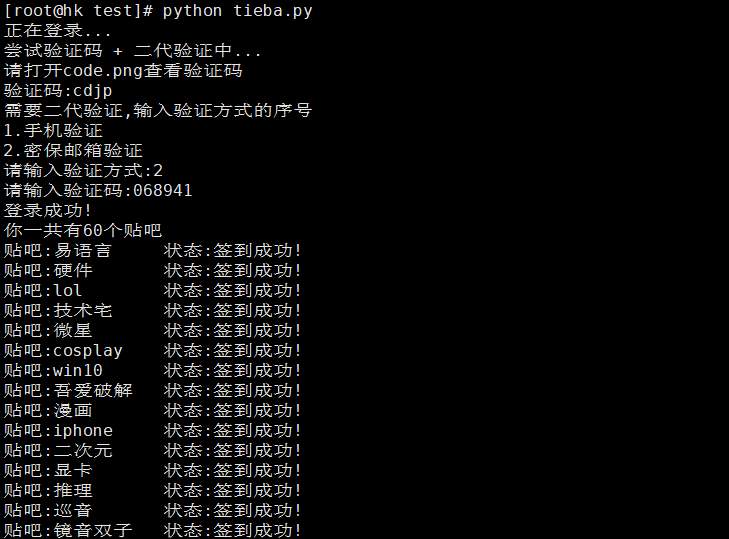

# tieba_sign
百度贴吧自动登录签到
## 效果


## 使用教程(Centos)
1、下载源码
``` sh
git clone https://github.com/MikuShare/tieba_sign/ && cd tieba_sign
```
2、安装Chromium<br>
``` sh
yum install chromium
```
3、安装[Chromedriver](https://chromedriver.storage.googleapis.com/index.html?path=73.0.3683.68/)<br>
``` sh
wget https://chromedriver.storage.googleapis.com/73.0.3683.68/chromedriver_linux64.zip && unzip chromedriver_linux64.zip
mv chromedriver /usr/bin/ && chmod a+x /usr/bin/chromedriver
```
4、安装依赖
``` sh
pip install requests
pip install lxml
pip install selenium
pip install Pillow
```
5、修改配置文件(config.py)
``` python
username = '帐号'
passwd = "密码"
```
## 运行
``` sh
python tieba.py   # 开始登录并签到
```

## TODO
- [ ] 添加打码平台
- [ ] 添加使用Cookies签到的脚本
## 注意事项&已知BUG
脚本使用Python3.7.2编写，运行的时候请使用Python3<br>
Ubuntu安装Chromium的命令是：sudo apt-get install chromium-browser
``` sh
sudo apt-get install chromium-browser
```
测试在Ubuntu跟Centos都通过，Windows应该也可以，但是有些地方应该改动，后续会上传Windows的。<br>
签到100个吧之后需要验证码，后续会解决这个问题，100个以内的贴吧可以完美签到。<br>
登录时候如果验证码是中文的，也支持输入。<br>
如果遇到各种报Chrome的错，请运行：
``` sh
pkill chrome*
```
遇到任何问题，请提交Issues！
## LICENSE
MIT
