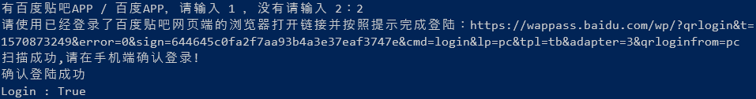

# tieba_sign
百度贴吧自动登录签到
## 效果


## 使用教程(Centos)
1、安装Chromium<br>
``` sh
yum install chromium
```
2、安装[Chromedriver](https://chromedriver.storage.googleapis.com/index.html?path=73.0.3683.68/)<br>
``` sh
wget https://chromedriver.storage.googleapis.com/73.0.3683.68/chromedriver_linux64.zip && unzip chromedriver_linux64.zip
mv chromedriver /usr/bin/ && chmod a+x /usr/bin/chromedriver
```
3、下载源码
``` sh
git clone https://github.com/MikuShare/tieba_sign/ && cd tieba_sign/
```
4、安装依赖
``` sh
pip install -r requirements.txt
```
5、修改配置文件(config.py)
``` python
# 填写你的贴吧帐号密码
username = '帐号'
passwd = "密码"
# 填写你的打码平台帐号密码,如没有请留空,密码可以为32位加密后的MD5
rk_captcha = False # 开启打码为True,关闭打码为False,开启打码后务必填写帐号密码。
username_rk = ''
passwd_rk = ''
```
## 运行
``` sh
python tieba.py   # 开始登录并签到
```

## TODO
- [ ] ~~添加打码平台~~(已完成)
- [ ] ~~添加使用Cookies签到的脚本~~(已完成)
- [ ] 多线程签到
- [ ] 多账号签到
## 注意事项&已知BUG
1.脚本使用Python3.7.2编写，运行的时候请使用Python3<br>
2.Ubuntu安装Chromium的命令是：sudo apt-get install chromium-browser
``` sh
sudo apt-get install chromium-browser
```
3.测试在Ubuntu跟Centos都通过，Windows应该也可以，但是有些地方应该改动，后续会上传Windows的。<br>
4.签到100个吧之后需要验证码，~~后续会解决这个问题~~(已经添加打码功能)，100个以内的贴吧可以完美签到。<br>
5.登录时候如果验证码是中文的，也支持输入。<br>
6.目前不支持多帐号签到，如果要切换帐号签到，那么需要删除运行目录下的.tieba_cookies文件，再把config.py文件里的贴吧帐号密码改掉即可。<br>
7.[若快打码](https://www.ruokuai.com/)的价格挺便宜，充4块钱能识别一千个这种验证码，我好像从15年就开始用了。<br>
8.有时候登录会遇到验证码+二代验证的情况，这个验证码不用打码是因为可能会出现中文验证码，如果调用中文验证码识别，识别速度会降低，并且价格也比数英验证码高，就干脆自己识别了。<br>
9.如果遇到各种报Chrome的错，请运行：
``` sh
pkill chrome*
```
10.遇到任何问题，请提交Issues！<br>
## ChangeLog
2019年3月25日<br>
1.修复不能正确判断验证类型的BUG(由于Centos安装的Chrome版本为71，Ubuntu为73，71版本的Chrome登录一定是验证码+二代验证，而73版本正常登录只有二代验证，所以这里判断策略出了点问题。)<br>
2019年3月20日<br>
1.由于签到一百个贴吧之后需要验证码，所以添加了打码功能，打码平台为[若快打码](https://www.ruokuai.com/)<br>
2.登录一次之后会自动保存cookies在本地，后续签到直接调用cookies。
## LICENSE
MIT
